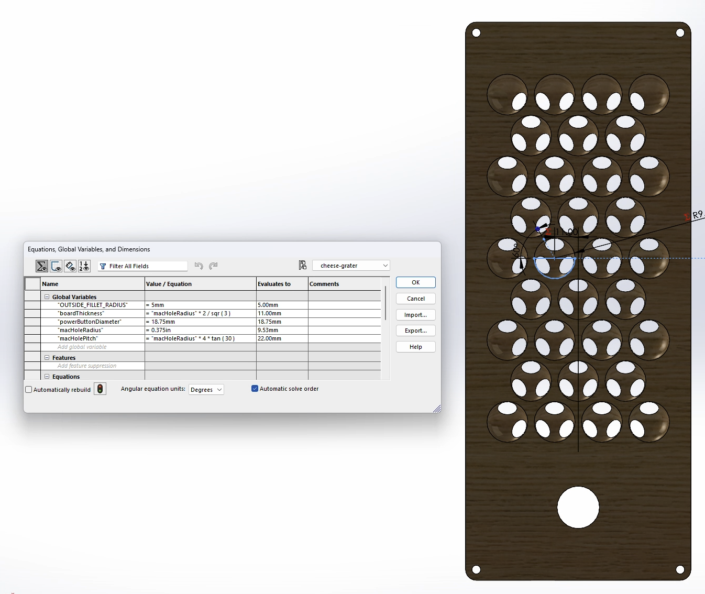

# Notes: Cheese Grater front
## Design
This front uses a pattern similar to the one that the MacPro6,1 (2019-2023) uses: 

Basically, this pattern is a hexagonal matrix of hemispherical holes on both sides of the material, offset
so that the intersecting holes appear only on three corners. Thankfulyl, there's many helpful articles on [modeling the holes](https://saccade.com/blog/2019/06/how-to-make-apples-mac-pro-holes/). This was extremely helpful for creating a 3D model, and showed me that the **thickness of the board is defined by hole size**. 

I used the equations given in the above article to produce a partially parametric model of the front to create a model:

A few things to notice from this front view:
1. Again---the thickness of the board is driven by the hole diameter (the real Mac Pro is apparently ~20mm)
1. Looking from the front, the top row of hemispheres has holes only on the bottom, and only one on the pair of outermost hemispheres
1. Looking from the front, bottom row has holes on both the top and bottom, and again only has one bottom hole on the outermost pair
1. Top and bottom rows are both the wider variation with more holes (4 vs 3 holes)

## Manufacturing
### Planing
1. Plane wood to a thickness of 11mm.

### Back 
1. Cut outline
    * all except final cut should be offset by 0.5mm out
    * final cut should be as designed
    
1. Remove excess wood
1. Recalibrate axes--with power button to left
1. Cut power button hole up to depth of 6mm
    * first cut: 3mm deep inset by 1mm
    * second cut: 6mm deep, as designed
1. Change bit to round 3/4" and cut hemispherical holes
    

This image shows the corner holes being cut along with the back: don't do this.

### Front
1. Change bit to 1/8" normal
1. Recalibrate axes--power button to left again
1. Cut corner mounting holes--full depth
1. Cut power button out to depth of 8mm
    * First 2 cuts: 3mm and 6mm deep, inset by 1mm
    * Final cut: 8mm deep, as designed
1. Change bit to round 3/4", cut hemispherical holes
    